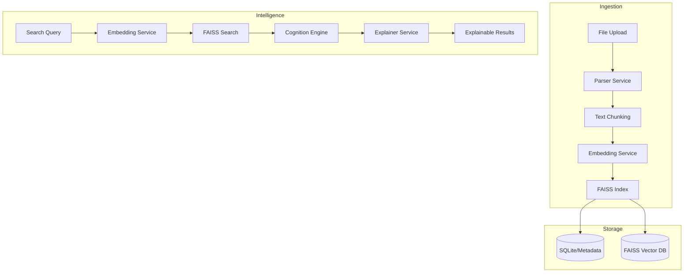

# NeuroVault 🧠

**NeuroVault** is an AI-powered Cognitive Storage Intelligence System designed to transform passive digital storage into an active, searchable, and explainable intelligence layer. By leveraging state-of-the-art vector embeddings, efficient similarity indexing, and a custom cognitive scoring algorithm, NeuroVault manages your knowledge base as a living memory.

---

## 🚀 Key Features

- **Semantic Intelligence**: Natural language search powered by `sentence-transformers` (384-dimensional embeddings).
- **Cognitive Re-Ranking**: Documents are weighted based on semantic match, recency of access, and historical frequency.
- **Explainable Retrieval**: Every search result includes a detailed AI-generated breakdown of *why* it was retrieved and how its score was calculated.
- **Memory Lifecycle Management**: Documents automatically transition through four tiers (Active, Contextual, Archived, Dormant) based on their "cognitive importance" over time.
- **Multi-Modal Parsing**: High-fidelity text extraction from PDF, DOCX, TXT, and images (OCR via Tesseract).
- **Dynamic Visualization**: Interactive D3.js "Memory Constellation" graph and lifecycle analytics dashboard.

---

## 🏗 Architecture



### The Cognitive Formula
NeuroVault doesn't just look for words; it measures the "utility" of a memory:
$$Score = (0.6 \times Semantic) + (0.2 \times Recency) + (0.2 \times AccessFrequency)$$

---

## 🛠 Tech Stack

- **Backend**: Python 3.11+, FastAPI (High-performance API)
- **AI/ML**: 
  - `sentence-transformers`: Local CPU-based embedding generation
  - `faiss-cpu`: High-speed similarity search indexing
- **Database**: SQLAlchemy + SQLite (Metadata tracking)
- **Frontend**: 
  - React + Vite (Fast UX)
  - TailwindCSS (Premium UI/UX)
  - D3.js (Advanced visualizations)
  - Framer Motion (Smooth animations)

---

## 📡 Quick Start

### 1. Prerequisites
- Python 3.11+
- Node.js & npm
- Tesseract OCR (Optional, for image parsing)

### 2. Backend Installation
```bash
cd backend
python -m venv venv
# Windows:
venv\Scripts\activate
# Linux/Mac:
# source venv/bin/activate

# Install dependencies (Optimized for Windows Wheels)
pip install -r requirements.txt

# Configure environment
copy .env.example .env

# Run server
uvicorn app.main:app --reload --port 8000
```
*API Docs: [http://localhost:8000/docs](http://localhost:8000/docs)*

### 3. Frontend Installation
```bash
cd frontend
npm install
npm run dev
```
*Web App: [http://localhost:5173](http://localhost:5173)*

---

## 📂 Project Structure

```text
NeuroVault/
├── backend/
│   ├── app/
│   │   ├── services/       # AI, FAISS, Cognition logic
│   │   ├── routers/        # API Endpoints
│   │   ├── models/         # Database ORM
│   │   └── main.py         # App Entry Point
│   └── requirements.txt
└── frontend/
    ├── src/
    │   ├── components/     # UI Building Blocks
    │   ├── pages/          # Core views (Dashboard, Search...)
    │   └── utils/          # API & D3 Helpers
    └── index.html
```

---

## 👀 Usage Guide

1. **Ingest**: Use the **Upload** page to drop files. The system will parse and index them in real-time.
2. **Search**: Enter concepts (e.g., "financial strategy" or "deep learning notes") in the **Search** page.
3. **Understand**: Expand the **AI Explanation** on any result to see the score breakdown.
4. **Monitor**: Visit the **Analytics** page to see your memory distribution across life-cycles.

---

## 🛡 License
MIT License. Created for the future of decentralized cognitive intelligence.

---

*NeuroVault — Intelligence, Explained.*
